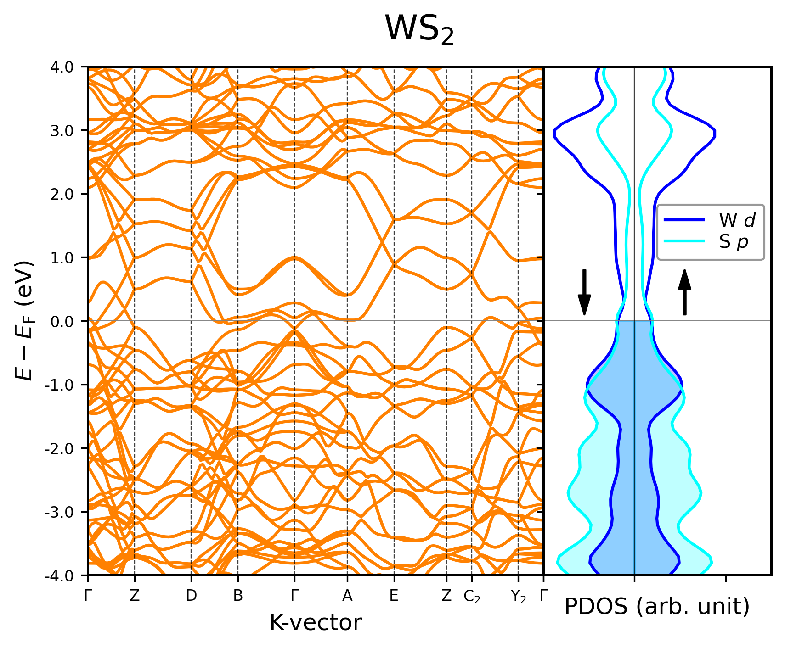

# Band-pDOS-QE
Scripts and inputs for calculating the band structure and pDOS in Quantum Espresso, and plotting the results together.

## Table of Contents

- [Band Structure and PDOS calculation in Quantum Espresso](#band)
  - [Example](#example)
  - [Usage](#usage)  
- [Acknowledgments](#ackw)
## Band Structure and PDOS calculation in Quantum Espresso

### Example 
A simple figure with bands and pDOS plots together

### Usage

TODO

## Acknowledgments

This project utilizes and modifies a script from **Levi Lentz's Blog** titled *[Combined Band Diagram and pDOS](https://levilentz.com/2020/02/25/combined-band-diagram-and-pdos/)*.  
I extend my gratitude to Levi Lentz for sharing this insightful resource, which formed the foundation of my work.
